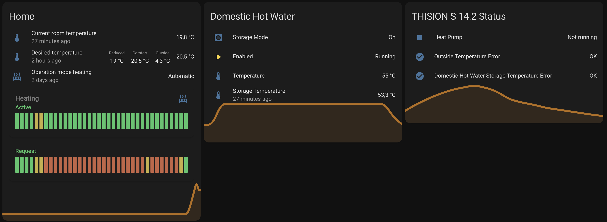

# ELCO-Remocon-net AppDaemon

AppDaemon to fetch data from the gas boiler system via the Elco Remocon-Net cloud service and push them to home-assistant entities.

Checkout [README](https://github.com/nechry/elco-remocon-net-appdaemon/blob/main/README.md) for detailed Instructions.

